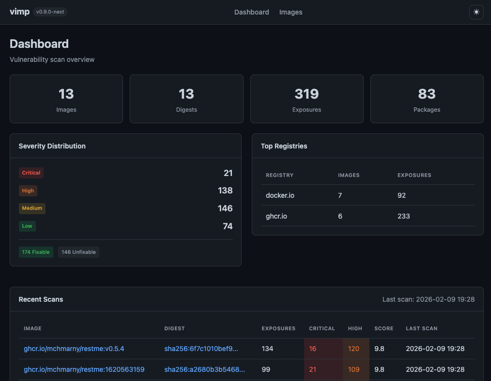
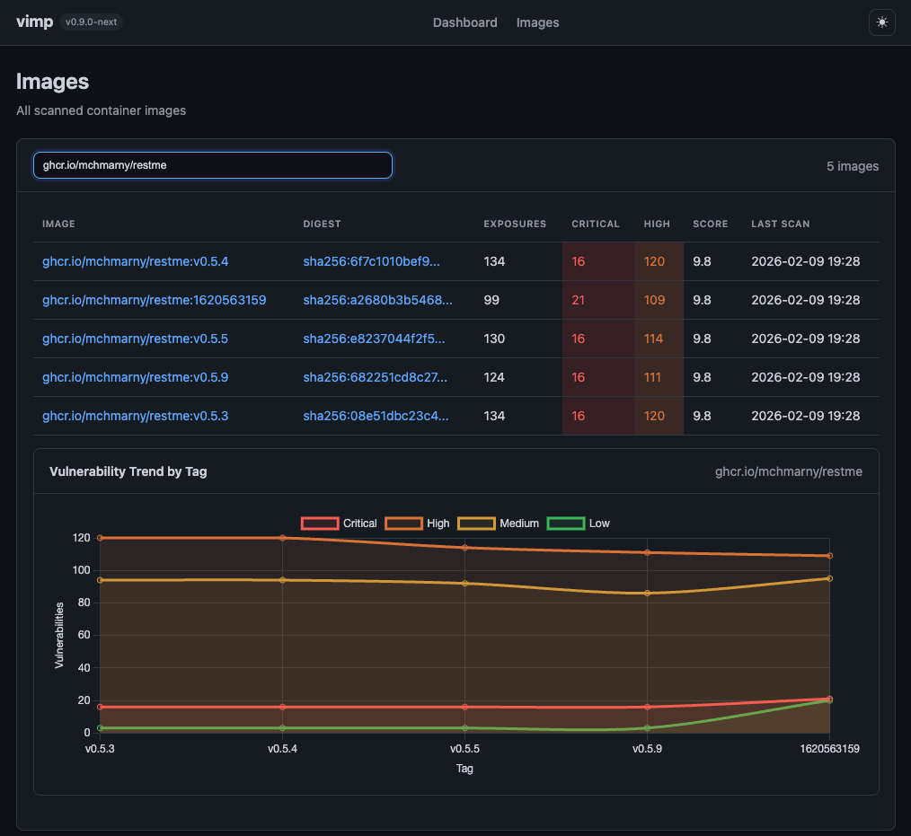

# vimp

[](https://github.com/mchmarny/vimp/actions/workflows/on-push.yaml)
[](https://github.com/mchmarny/vimp/actions/workflows/on-tag.yaml)
[](https://goreportcard.com/report/github.com/mchmarny/vimp)
[](LICENSE)

Normalize vulnerability data from multiple container image scanners into a unified format for cross-scanner comparison and trend analysis.

## Why vimp?

Different vulnerability scanners often report different findings for the same container image. vimp helps you:

- **Compare results** across scanners to identify gaps in coverage
- **Track trends** over time with persistent storage
- **Integrate with CI/CD** using `SARIF` output for GitHub Code Scanning
- **Reduce noise** by correlating findings across sources



## Quick Start

```bash
# Install vimp
brew tap mchmarny/vimp && brew install vimp

# Scan an image (requires grype, trivy, or snyk installed)
vimp scan --image alpine:latest --yes

# Query results
vimp query --image docker.io/library/alpine

# Run server (view reports, CVEs over time)
vimp server --open
```



## Documentation

- **[User Guide](docs/user-guide.md)** - Step-by-step workflow tutorial with runnable examples
- **[CLI Reference](docs/cli-reference.md)** - Complete command documentation

## Supported Scanners

| Scanner | Format Detection | CVSS Support |
|---------|------------------|--------------|
| [Grype](https://github.com/anchore/grype) | `descriptor.name == "grype"` | Full |
| [Trivy](https://github.com/aquasecurity/trivy) | `SchemaVersion` + `Results` | Full |
| [Snyk](https://github.com/snyk/cli) | `vulnerabilities` + `applications` | Full |
| [Clair](https://github.com/quay/clair) | `manifest_hash` + `vulnerabilities` | None |
| [OSV-Scanner](https://github.com/google/osv-scanner) | `results[*].packages[*].ecosystem` | Partial |
| [Anchore Engine](https://github.com/anchore/anchore-engine) | `imageDigest` + `vulnerabilities` | Full |

## Storage Backends

| Backend    | URI Format                     | Query Support |
|------------|--------------------------------|---------------|
| SQLite     | `sqlite://path/to/db.db`       | Yes           |
| PostgreSQL | `postgres://host:port/db`      | Yes           |
| BigQuery   | `bq://project.dataset.table`   | Import only   |
| File       | `file://path/to/output.json`   | No            |
| Console    | `console://`                   | No            |

Default: `sqlite://~/.vimp.db`

## Installation

### Homebrew (macOS/Linux)

```bash
brew tap mchmarny/vimp
brew install vimp
```

### Go

```bash
go install github.com/mchmarny/vimp@latest
```

### Binary

Download from [releases](https://github.com/mchmarny/vimp/releases/latest). All releases include:
- SHA256 checksums
- SPDX SBOMs
- Build provenance attestations

### Linux Packages

**Debian/Ubuntu:**
```bash
VERSION=$(curl -s https://api.github.com/repos/mchmarny/vimp/releases/latest | jq -r .tag_name)
wget https://github.com/mchmarny/vimp/releases/download/${VERSION}/vimp-${VERSION#v}_linux-amd64.deb
sudo dpkg -i vimp-${VERSION#v}_linux-amd64.deb
```

**RHEL/CentOS:**
```bash
VERSION=$(curl -s https://api.github.com/repos/mchmarny/vimp/releases/latest | jq -r .tag_name)
sudo rpm -ivh https://github.com/mchmarny/vimp/releases/download/${VERSION}/vimp-${VERSION#v}_linux-amd64.rpm
```


## Contributing

Contributions are welcome! See the [Development Guide](DEVELOPMENT.md) for setup instructions, architecture overview, and coding guidelines.

## License

[Apache 2.0](LICENSE)

## Disclaimer

This is a personal project and does not represent my employer. While I do my best to ensure everything works, I take no responsibility for issues caused by this code.
