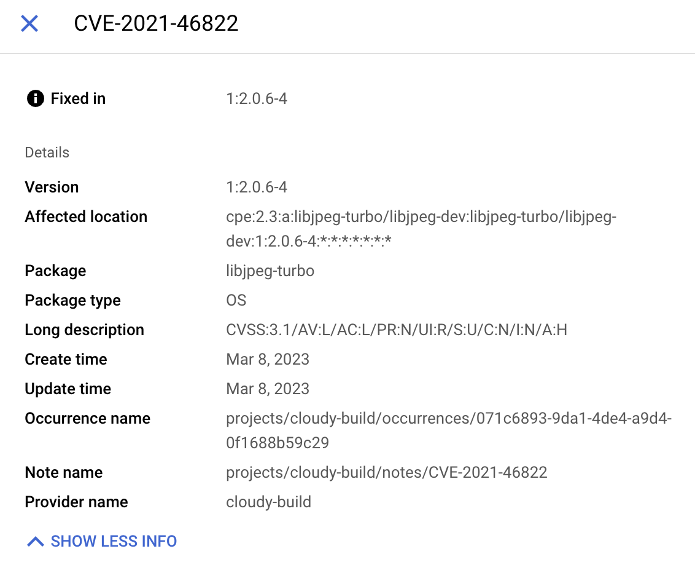

# vulctl as builder in Google Cloud Build (GCB)

In addition to being used as a CLI, `vulctl` can also be used as a builder.

## Adding vulctl step to your pipeline

To use `vulctl` in your GCB pipeline you will need to add the following step: 

```yaml
- id: import
name: us-west1-docker.pkg.dev/cloudy-build/vulctl/vulctl
waitFor: [scan]
args: ['import', '--project', '$PROJECT_ID', '--source', '${_IMAGE}', '--file', 'report.json', '--format', 'grype']
```

See [examples/cloud-build/cloudbuild.yaml](./cloudbuild.yaml) for full example scanner (using `grype`), and vulnerability import.

> The [Dockerfile](../../Dockerfile) used to build the `vulctl` builder image is can be found in the root of the repo.

## GCB Build Log

When executed in GCB, the log output should look something like this: 

```shell
Starting Step #1 - "import"
Step #1 - "import": Pulling image: us-west1-docker.pkg.dev/cloudy-build/vulctl/vulctl
Step #1 - "import": Using default tag: latest
Step #1 - "import": latest: Pulling from cloudy-build/vulctl/vulctl
Step #1 - "import": 383e1c5dd0c1: Already exists
Step #1 - "import": aae7d8d7354c: Pulling fs layer
Step #1 - "import": aae7d8d7354c: Verifying Checksum
Step #1 - "import": aae7d8d7354c: Download complete
Step #1 - "import": aae7d8d7354c: Pull complete
Step #1 - "import": Digest: sha256:614e8857ce80f85ea294aa46cfb7286f819c9b788cf4f11ef1dfe5b1a96c6537
Step #1 - "import": Status: Downloaded newer image for us-west1-docker.pkg.dev/cloudy-build/vulctl/vulctl:latest
Step #1 - "import": us-west1-docker.pkg.dev/cloudy-build/vulctl/vulctl:latest
Step #1 - "import": INF v0.2.8 (commit: b1c2d651fc5b2b5528db3ab593b6474042736551, built: 2023-03-10 01:49 UTC)
Step #1 - "import": INF Found 298 vulnerabilities
Step #1 - "import": INF Created: projects/cloudy-build/notes/CVE-2017-18018
Step #1 - "import": INF Created: projects/cloudy-build/occurrences/033d21f6-2d54-4a21-bf19-96812b16b2a9
Step #1 - "import": INF Already Exists: projects/cloudy-build/notes/CVE-2020-14145
Step #1 - "import": INF Created: projects/cloudy-build/occurrences/209d89f9-b0f8-4f32-a18f-52532aaa55c2
Step #1 - "import": INF Created: projects/cloudy-build/notes/CVE-2021-3549
Step #1 - "import": INF Created: projects/cloudy-build/occurrences/ba1f492a-b893-4102-a1fe-79f0e3f105ad
Finished Step #1 - "import"
PUSH
DONE
```

## Artifact Registry Side Panel

When completed, you can view the data imported by `vulctl` in Artifact Registry side panel. 


